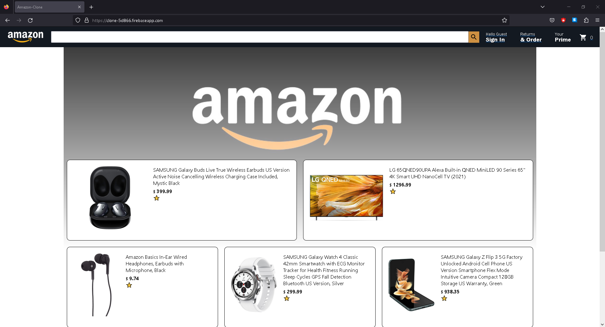
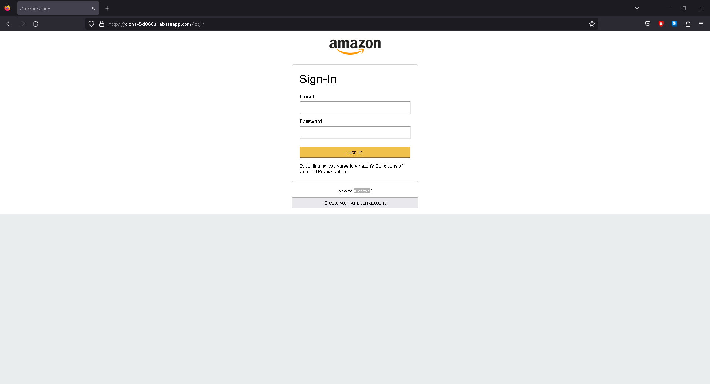
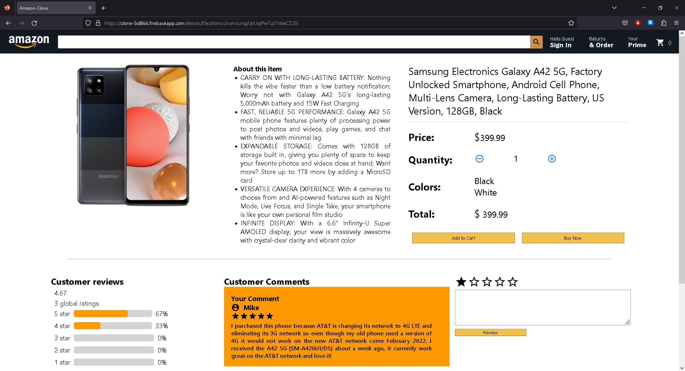

<br/>
<p align="center">
  <a href="https://github.com/Daniel-Xie-Dev/amazon-clone">
    
  </a>

  <h3 align="center">E-Commerce Site (Amazon Clone)</h3>

  <p align="center">
    A full-stack project that mimics Amazon's website. 
    <br/>
    <br/>
    <a href="https://github.com/Daniel-Xie-Dev/amazon-clone"><strong>Explore the docs »</strong></a>
    <br/>
    <br/>
  </p>
</p>


## Table Of Contents

* [About the Project](#about-the-project)
* [Built With](#built-with)
* [Getting Started](#getting-started)
  * [Prerequisites](#prerequisites)
  * [Installation](#installation)
* [Usage](#usage)
* [Contributing](#contributing)
* [License](#license)
* [Authors](#authors)
* [Acknowledgements](#acknowledgements)

## About The Project



Amazon has been my go-to e-commerce site for as long as I can remember. It played a crucial role during my high school years and continued to be a reliable companion throughout my college journey. As a software engineer, I wanted to put my skills to the test and challenge myself by creating a project similar to Amazon.

This project encompasses a range of features, including:
+ Sign in and sign up: A user-friendly system that allows you to easily create an account or log in to access all the features.
+ Secure authorization: Contains authorization checks to ensure that only authorized users can make transactions
+ Shopping cart convenience: A smooth and intuitive shopping cart experience that lets you view and manage your selected items effortlessly.
+ Add or remove with ease: Whether you're adding items to your cart or deciding to remove them, it's all just a few clicks away. 
+ Track your orders: Keep tabs on your previous orders with the convenience of order history.
+ Share your thoughts: Want to give feedback or share your experience with a product? A rating and commenting feature is included, so you can let others know what you think.
+ Find what you need: Looking for something specific? Simply use the search bar to find the products you're after quickly. It's designed to make your shopping experience efficient and enjoyable.

## Built With

+ ReactJS
+ Google Firebase
+ Git
+ MaterialUI

## Getting Started

To get a local copy up and running follow these simple example steps.

### Prerequisites

* npm

```sh
npm install npm@latest -g
```

### Installation

1. Create a firebase account and set up a new project. [Introduction to Firebase](https://www.youtube.com/watch?v=9kRgVxULbag)

2. Clone the repo

```sh
git clone https://github.com/Daniel-Xie-Dev/amazon-clone.git
```

3. Install NPM packages

```sh
npm install firebase
npm install axios
npm install @mui/material @emotion/react @emotion/styled
```

4. Create a file called `firebase.js` and copy the firebase configuration.

```JS
const firebaseConfig = {
  apiKey: "YOUR_API_KEY",
  authDomain: "YOUR_AUTH_DOMAIN",
  projectId: "YOUR_PROJECT_ID",
  storageBucket: "YOUR_STORAGE_BUCKET",
  messagingSenderId: "YOUR_MESSAGE_SENDER_ID",
  appId: "YOUR_APP_ID",
  measurementId: "YOUR_MEASUREMENT_ID",
};
```

## Usage




## Contributing


### Creating A Pull Request

1. Fork the Project
2. Create your Feature Branch (`git checkout -b feature/AmazingFeature`)
3. Commit your Changes (`git commit -m 'Add some AmazingFeature'`)
4. Push to the Branch (`git push origin feature/AmazingFeature`)
5. Open a Pull Request

## License

Distributed under the MIT License. See [LICENSE](https://github.com/Daniel-Xie-Dev/amazon-clone/blob/main/LICENSE.md) for more information.

## Authors

* Daniel Xie - *Software Engineer* - [ Daniel Xie](https://github.com/Daniel-Xie-Dev) - *Design, built, and tested project.*

## Acknowledgements

* [Daniel Xie](https://github.com/Daniel-Xie-Dev)
